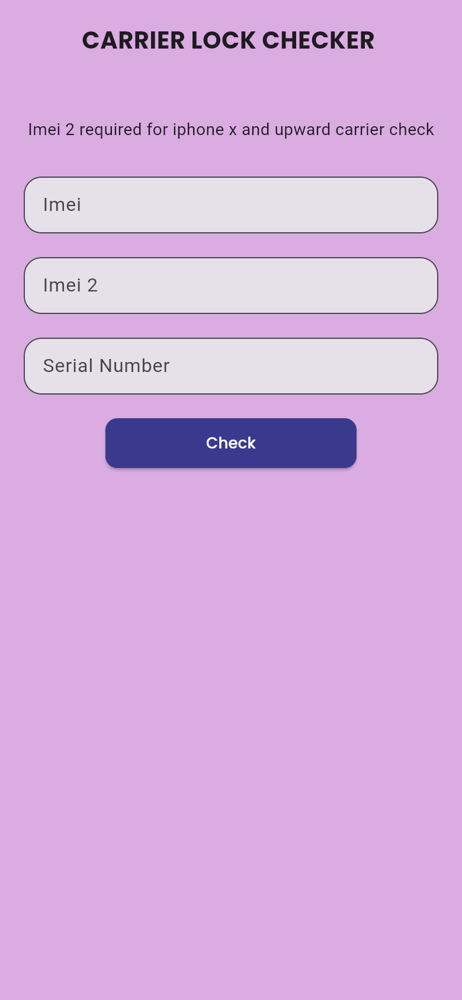
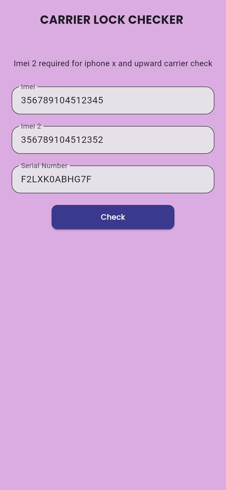

# Carrier Lock Checker

**A Flutter utility that checks an iPhone's carrier-lock status from its IMEI, IMEI 2 and serial number.**


## Screenshots

<table>
  <tr>
    <td align="center"><br><sub>Checker form</sub></td>
    <td align="center"><br><sub>Ready to check (sample values)</sub></td>
  </tr>
</table>

## Features

- Enter **IMEI**, **IMEI 2** (needed for iPhone X and newer) and **serial number**.
- Sends the details to a third-party carrier-check service over HTTP.
- **Cleans the HTML response** (unescapes entities with `html_unescape` and strips tags with a regex), then shows the result in a dialog.

## Tech stack

| Area | Tools |
|---|---|
| Framework | Flutter, Dart 3 |
| Networking | `http` |
| Parsing | `html_unescape`, `RegExp` |
| UI | Material, `google_fonts` (Poppins) |

## Project structure

```
lib/
├── main.dart        # App entry
└── homescreen.dart  # Form, HTTP request, response cleaning, result dialog
```

## Getting started

```bash
git clone https://github.com/Mickool17/pixel_carrier_checker.git
cd pixel_carrier_checker
flutter pub get
flutter run
```

> Results depend on the availability of the third-party lookup service the app calls.

## Author

Built by [@Mickool17](https://github.com/Mickool17)
